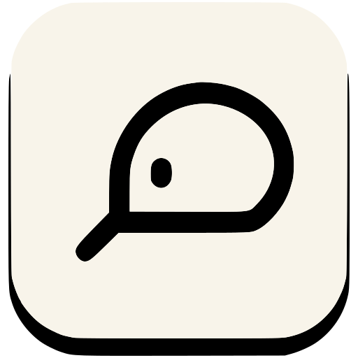

# ClickPrompt - Streamline your prompt design

[](https://github.com/prompt-engineering/click-prompt/actions/workflows/ci.yaml)




[English](./README.md) | 简体中文

> ClickPrompt 是一款专为 Prompt 编写者设计的工具，它支持多种基于 Prompt 的 AI 应用，例如 Stable Diffusion、ChatGPT 和 GitHub Copilot 等。
> 使用 ClickPrompt，您可以轻松地查看、分享和一键运行这些模型，同时提供在线的 Prompt 生成器，使用户能够根据自己的需求轻松创建符合要求的 Prompt，并与其他人分享。

立即尝试：https://www.clickprompt.org/

备用地址：

- https://prompt.phodal.com
- https://clickprompt.vercel.app

扫一扫加入 ClickPrompt 微信群:


**二维码达到上限，加小助手微信【`JavaScript_2333`】发送【`ClickPrompt`】邀请进群**

## 功能:

- 一键运行：支持 ChatGPT 和 StableDiffusion 的一键运行，让您更轻松地学习和使用 Prompt。
- Prompt 在线生成器：使用热门的 StableDiffusion 人物生成器和 StableDiffusion -> ChatGPT 生成器，快速创建符合您需求的高质量 Prompt。
- Prompt 样例库：从我们的用户生成的 Prompt 样例中学习，包括 StableDiffusion、ChatGPT 和 GitHub Copilot。展示您的工作并与他人分享。
- 行业特定的 Prompt 生成器：提高您的工作效率，目前提供的领域包括编程、写作和设计。
- Prompt 优化（PoC 思考中）：使用 Prompt 优化器，帮助您提高 Prompt 的质量。

## 路线图

阶段 1: MVP

- 支持基于 Prompt 的 AI 应用，包括 ChatGPT 和 Stable Diffusion。
- 提供 Prompt 生成器和一键运行功能。
- 提供用户样例展示功能。

阶段 2: 拓展功能

- 增加 GPT-3 和 DALL-E 等基于 Prompt 的 AI 应用。
- 提供用户自定义选项和多语言支持功能。
- 增加 AI 编辑器和用户权限管理功能。
- 支持 API 接口和其他第三方平台的集成。

阶段 3: 提高质量

- [ ] 改进 Prompt 生成器的算法，提高生成的文本质量和准确性。
- [ ] 增加用户反馈和评价功能，收集用户的建议和意见。
- [ ] 推广 ClickPrompt，并与各行业合作，为其提供高效的 AI 应用解决方案。

## 开发

### 技术栈:

- Next.js with Typescript
- Chakra UI
- Styled Components: @emotion/styled
- React Table
- React Markdown for render markdown
- Data processing
  - papaparse: parse csv
  - arrow: parse json

### 待办:

- [x] setup projects
  - [x] init project
  - [x] setup CI
  - [x] config prettier, eslint, husky
  - [x] commit lint, style lint
- [ ] setup docs
- [ ] our cheatsheet
- [x] ChatGPT prompts
  - [ ] awesome act prompts
  - [ ] chinese version prompts
  - [ ] normal generator by category
  - [ ] random generator
  - [x] samples
- [x] Stable Diffusion
  - [ ] awesome act prompts
  - [ ] random generator
  - [x] normal generator
  - [x] samples
- [ ] GitHub Copilot
  - [x] samples

### 在本地运行 ClickPrompt

```shell
# Clone click-prompt
git clone https://github.com/prompt-engineering/click-prompt

cd click-prompt

npm install

npm run dev

# Build
npm run build
```

更多请查阅[贡献指南](./CONTRIBUTING.md)。

## 贡献指南

欢迎新的贡献者。查看我们的[贡献指南](./CONTRIBUTING.md)帮助你开始你的贡献。


## 翻译指南

查看专用的 [i18n 指南](./TRANSLATING.md)以获取更多详细信息。

## License

ClickPrompt 使用 MIT 协议发布。在 [LICENSE](./LICENSE) 文件查看详情。
